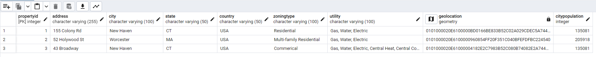
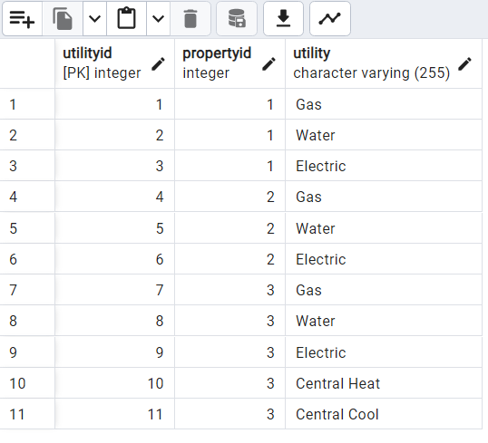
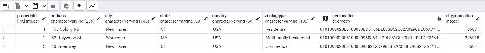
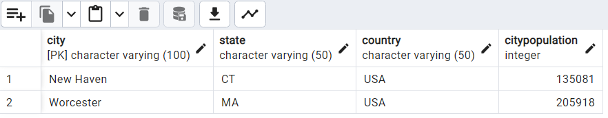
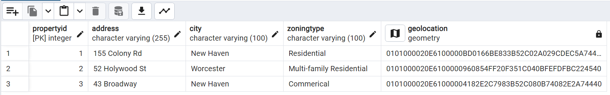
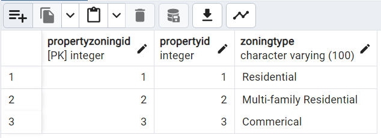
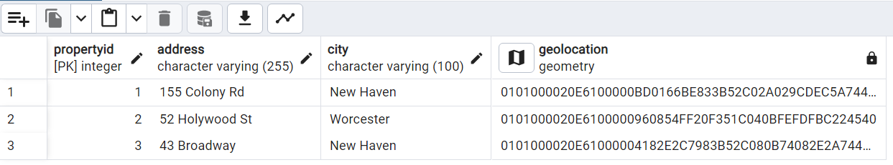
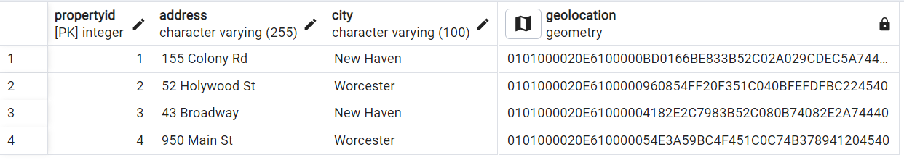

1. Submission includes SQL scripts and a Markdown report detailing how the normalization principles are applied.

2. GitHub repository is organized with a comprehensive README.md and the report details how each SQL command satisfies normalization principles. Collaborators are invited for review.

3. The Markdown report should detail the journey from 1NF through to 4NF, providing specific examples from your SQL scripts and explaining why each step satisfies the corresponding normalization form.

4. Pay special attention to the clarity of your explanations in the Markdown report. The goal is to demonstrate your understanding of database normalization and spatial data management through detailed examples and explanations.

5. Include a section in your README.md on how to set up PostGIS and prerequisites for running your SQL scripts, alongside the Markdown report for normalization explanation.

1. Ulitlity does not contain atomic values, so it must be split into a separate table called ' ultilities' 

# Normalizing Spatial Data in a Real Estate Database 
## Spatial Databases IDCE 376 | Assignment 3: | Clio Bate | 02/21/2024

This project was created as part of the class Spatial Databases at Clark University Spring, 2024. The objective of this assignent is to continue to work with the concept of database normalization by creating a non-normal database of addresses that include geospatial locations and city population data and working with PostGIS. We are to normalize it all the way through to 4NF. To write and implement the SQL script I used the SQLShell to interact with PGAdmin with PostGIS extension and used VSCode to manage my repository and store my SQL script.     
The full assignment instructions can be found on the class website, [here](https://studyingplace.space/spatial-database/labs/A3-Real_Estate_Database.html#part-4-normalize-to-4nf)  

**What is PostGIS?** PostGIS is an extension for PGAdmin that allows an analyist to work with geospatial objects and perform spatial queries.

Database normalization rules:  
**1NF**: A 1NF table should have all atomic values—there should be no repeating values within a column— and each row should be uniquely idenfiable by a primary key
**2NF**: A 2NF table should meet at 1NF standards and also not have any partial dependencies— aka no column should depend on any other column other than the primary key.  
**3NF**: A 3NF table should meet all 2NF standards annd also not have any transisitive depencencies— aka the primary key must fully define all non-key columns and each column cannot depend on another column other than said primary key.  
**4NF**: A 4NF table should meet all 3NF standards and not have any non multivariate dependencies. MVD occurs when two(or more) columns in a table are independent of each other buth both depend on the same Primary Key.  

### This repository includes
1. README.MD (this document): A Markdown file containing the Normalization Report.
1. analysis.sql : A commented SQL script that created and normaled tables.
1. Screenshots showing the structures of my final tables in pgAdmin. The screenshots of each table includes:  
    - PropertyDetails_01.png = 'orignal' table 
    - Utilities_1NF_2NF.png = 1NF/ 2NF
    - PropertyDetails_1NF_2NF.png = 1NF/ 2NF
    - PropertyDetails_3NF.png = 3NF
    - CityDemographics_3NF.png = 3NF
    - PropertyDetails4NF.png  = 4NF  
    - Zoning_4NF.png  = 4NF  
    - PropertyDetails4NF_plus1 = 4NF
    

### Methods

Before trying to replicate this Database setup using SQL Shell to interact is PgAdmin and makesure PostGIS is installed:  
- create new database called RealEstateDB  
`CREATE DATABASE RealEstateDB;`

- Ensure that the shell is connected to RealEstateDB  
`\c realestatedb`

- Enable PostGIS  
`CREATE EXTENSION IF NOT EXISTS postgis;`  

#### Analysis
**STEP 1** create and populate the table PropertyDetails, which will have 9 columns and will be a nonnormalized table storing all the original information.
There will be a geometry column that will store the long lat data- this is possible due to our PostGIS extension. Here is an example row of code of PropertyDetails. See the file analysis.sql for the full code.  
`(2, '52 Holywood St', 'Worcester', 'MA', 'USA', 'Multi-family Residential', 'Gas, Water, Electric', ST_GeomFromText('POINT(-71.798889 42.271389)', 4326) , '205918'),'`
    
Original, non-normal PropertyDetails table:  
  
  
Now the datatables need to be normalized. Each column needs to have atomic values and depend on only one unique primary key. The column, "Utlitly" does not have atomic values, and therefore our data table needs to be split into two tables.
**STEP 2** Create a new table Utilties from PropertyDetails with PropertyID as the foreign key and populate the table with utilities from the original table with each associated address. Drop the now redundant Utility from PropertyDetails  
  
Ultilities table 1NF/2NF:  
   
  
Code to create Utilities table:  
`CREATE TABLE Utilities (
UtilityID SERIAL PRIMARY KEY,
PropertyID INT,
Utility VARCHAR(255),
FOREIGN KEY (PropertyID) REFERENCES PropertyDetails(PropertyID)
);`  

`INSERT INTO Utilities (PropertyID, Utility) VALUES
(1, 'Gas'), 
(1, 'Water'),
(1, 'Electric'),
(2, 'Gas'), 
(2, 'Water'),
(2, 'Electric'),
(3, 'Gas'), 
(3, 'Water'),
(3, 'Electric'),
(3, 'Central Heat'), 
(3, 'Central Cool');`  

Now we have two tables PropertyDetails and Utilities. Both tables are in 2NF becase they are in 1NF and there are no partial dependencies. In order to make our data 3NF we must remove all transitive dependenies. In this case 'State', 'Country', and 'CityPopulation' have a transtitive dependency on 'City'.
  
PropertyDetails 1NF/2NF table:  
   

**STEP 3**  Create a table 'CityDemographics' to store State, Country, and CityPopulation for each address and drop the columns from 'PropertyDetails'. 
   
Example of CityDemographics table:  
   
  
PropertyDetails 3NF table:  
   
    
There is a Multivariate dependency in PropertyDetails. 'Zoning' is not directly related to 'City', but both 'Zoning' and 'City' rely directly on the Primary Key. It would be best if they were split into two differnt columns.  

**STEP 4**  Create the table PropertyZoning and ensure to include the code that PropertyID in Zoning references PropertyID in PropertyDetails. Populate the table and then drop 'Zoning' from Property Details  
`PropertyID INT REFERENCES PropertyDetails(PropertyID)`  
  
Example of Zoning table:  
     
By the end your 'PropertyDetails' should look like this:  
   

**STEP 5** As a test, you can insert a new point into your PropertyDetails table. I chose  
`INSERT INTO PropertyDetails (PropertyID, Address, City, GeoLocation) VALUES 
(4, '950 Main St', 'Worcester', ST_GeomFromText('POINT(-71.8245 42.2520)', 4326));`

Screenshot of Propertydetails after inserting additional value
   
### Challenges
Here I detail the chalenges I encountered in the form of a numbered list:  
1. I tried to make Utilies prim key dependent on the foreing key from property descriptions instead of properties, which resulted in the error:  
`ERROR:  duplicate key value violates unique constraint "utilities_pkey"
DETAIL:  Key (propertyid)=(1) already exists.`  
This made me realize that I had set Property ID as my serial primary key instead of Utility ID so instead of this:  
`CREATE TABLE Utilities (
UtilityID SERIAL PRIMARY KEY,
PropertyID INT,
Utility VARCHAR(255),
FOREIGN KEY (PropertyID) REFERENCES Properties(PropertyID)
);`  
I had written this which was resulting in the error:  
`CREATE TABLE Utilities (
PropertyID SERIAL PRIMARY KEY,
Utility VARCHAR(255),
FOREIGN KEY (PropertyID) REFERENCES Properties(PropertyID)
);`

1. When trying to preform spatal analaysis...
`INSERT INTO Properties (Address, City, GeoLocation) VALUES
realestatedb-# ('950 Main St', 'Worcester', ST_GeomFromText('POINT(-71.8245 42.2520)', 4326));`
I recieved this error:  
`ERROR:  duplicate key value violates unique constraint "properties_pkey"
DETAIL:  Key (propertyid)=(1) already exists.`  
I realized that there was no primary key in my insert, so I labeled it as 4. and put that infrom the 950 Main St.

1.  I will ask in class/office hours, but writing this down here as well 
Question: Why is it that in 'CityDemographics' the column 'City' is used as a primary key? why is it not a serial primary key called 'CityID' with 'City' as a separate column'? Is it because it is atomic and therefore doesnt need a numeric ID? Furthermore, in the SQL query we didn't have 'CityDemographics' reference the original table, I suppose this is because 'City' in 'PropertyDetails' is not a Primary Key, but then , how does the database know the two tables are linked?  
Another question: why is it that address and city are not considered to have a partial dependency?
- I should have gone to office hours with this questions, I will this week!
